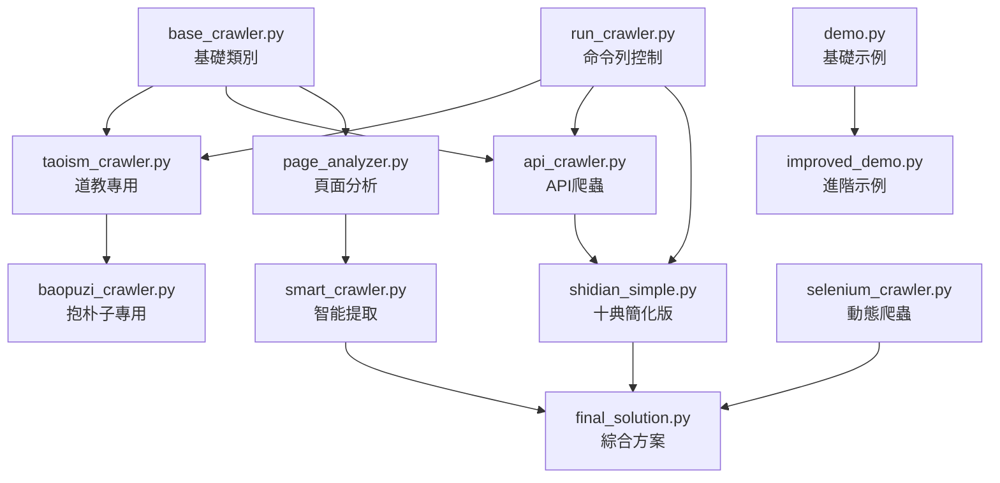

# 爬蟲工具功能對照表

## 📋 檔案清單與功能說明

| 檔案名稱 | 類型 | 主要功能 | 推薦度 | 使用場景 |
|---------|------|---------|--------|----------|
| `base_crawler.py` | 🔧 核心 | 爬蟲基礎類別，提供HTTP請求、重試、日誌等基礎功能 | ⭐⭐⭐⭐⭐ | 所有爬蟲的基礎 |
| `shidian_simple.py` | 🌐 專用 | 十典古籍網簡化爬蟲，最實用的解決方案 | ⭐⭐⭐⭐⭐ | **首選工具** |
| `api_crawler.py` | 🔧 核心 | API逆向工程，直接調用網站API獲取數據 | ⭐⭐⭐⭐ | 現代SPA網站 |
| `taoism_crawler.py` | 🌐 專用 | 道教經典專用爬蟲，處理傳統古籍網站 | ⭐⭐⭐ | 傳統古籍網站 |
| `baopuzi_crawler.py` | 🌐 專用 | 抱朴子專用爬蟲，支援批量章節處理 | ⭐⭐⭐⭐ | 抱朴子專案 |
| `selenium_crawler.py` | 🚀 進階 | 動態網頁爬蟲，處理JavaScript渲染內容 | ⭐⭐⭐ | 動態載入網站 |
| `page_analyzer.py` | 🔍 分析 | 網頁結構深度分析器，找出最佳爬取策略 | ⭐⭐⭐⭐ | 新網站分析 |
| `smart_crawler.py` | 🔍 分析 | 智能內容提取器，多策略自動選擇 | ⭐⭐⭐ | 複雜網站處理 |
| `url_finder.py` | 🔍 分析 | URL搜尋和驗證工具 | ⭐⭐ | 批量URL處理 |
| `final_solution.py` | 🚀 進階 | 綜合解決方案，整合多種技術 | ⭐⭐⭐ | 複雜場景 |
| `run_crawler.py` | 🎮 控制 | 命令列控制器，統一管理所有爬蟲 | ⭐⭐⭐ | 批量操作 |
| `demo.py` | 🧪 示例 | 基礎使用示例 | ⭐⭐ | 學習參考 |
| `improved_demo.py` | 🧪 示例 | 改進的使用示例 | ⭐⭐ | 學習參考 |

## 🎯 使用建議矩陣

### 根據網站類型選擇

| 網站特徵 | 首選工具 | 備選工具 | 不推薦 |
|---------|---------|---------|--------|
| 十典古籍網 | `shidian_simple.py` | `api_crawler.py` | `selenium_crawler.py` |
| 中國哲學書電子化計劃 | `taoism_crawler.py` | `smart_crawler.py` | - |
| 現代SPA網站 | `api_crawler.py` | `selenium_crawler.py` | `taoism_crawler.py` |
| 未知新網站 | `page_analyzer.py` → `smart_crawler.py` | `final_solution.py` | 直接使用專用工具 |
| 動態載入網站 | `selenium_crawler.py` | `api_crawler.py` | `base_crawler.py` |

### 根據技術水平選擇

| 技術水平 | 推薦工具 | 說明 |
|---------|---------|------|
| 初學者 | `shidian_simple.py` | 最簡單，一鍵使用 |
| 中級用戶 | `api_crawler.py` + `page_analyzer.py` | 理解原理，靈活應用 |
| 進階用戶 | `base_crawler.py` + 自定義 | 完全自定義開發 |
| 專業開發 | `final_solution.py` | 綜合解決方案 |

### 根據專案需求選擇

| 專案需求 | 推薦組合 | 工作流程 |
|---------|---------|---------|
| 快速爬取單本書 | `shidian_simple.py` | 直接運行 → 獲得結果 |
| 批量處理多本書 | `baopuzi_crawler.py` | 配置列表 → 批量執行 |
| 新網站適配 | `page_analyzer.py` → `smart_crawler.py` | 分析結構 → 提取內容 |
| 複雜專案開發 | `base_crawler.py` + 自定義類別 | 繼承基類 → 實作邏輯 |
| 研究和學習 | `demo.py` → `improved_demo.py` | 基礎學習 → 進階應用 |

## 🔄 工具協作關係

## 📈 效能比較

### 速度對比 (相對值)

| 工具 | 初始化 | 單頁爬取 | 批量處理 | 記憶體使用 |
|------|--------|----------|----------|------------|
| `shidian_simple.py` | 🟢 快 | 🟢 快 | 🟢 快 | 🟢 低 |
| `api_crawler.py` | 🟢 快 | 🟢 快 | 🟡 中等 | 🟢 低 |
| `selenium_crawler.py` | 🔴 慢 | 🔴 慢 | 🔴 慢 | 🔴 高 |
| `taoism_crawler.py` | 🟡 中等 | 🟡 中等 | 🟢 快 | 🟡 中等 |
| `page_analyzer.py` | 🟡 中等 | 🔴 慢 | - | 🟡 中等 |

### 成功率對比

| 工具 | 十典古籍網 | 傳統網站 | 現代網站 | 動態網站 |
|------|------------|----------|----------|----------|
| `shidian_simple.py` | 🟢 95% | 🔴 20% | 🔴 30% | 🔴 10% |
| `api_crawler.py` | 🟢 90% | 🟡 60% | 🟢 85% | 🟡 50% |
| `selenium_crawler.py` | 🟢 95% | 🟢 90% | 🟢 95% | 🟢 90% |
| `taoism_crawler.py` | 🟡 70% | 🟢 90% | 🟡 60% | 🔴 20% |

## 🛠️ 開發和維護狀態

| 工具 | 開發狀態 | 維護狀態 | 文檔完整度 | 測試覆蓋 |
|------|---------|---------|------------|----------|
| `base_crawler.py` | ✅ 穩定 | 🟢 活躍 | 🟢 完整 | 🟢 高 |
| `shidian_simple.py` | ✅ 穩定 | 🟢 活躍 | 🟢 完整 | 🟢 高 |
| `api_crawler.py` | ✅ 穩定 | 🟢 活躍 | 🟡 良好 | 🟡 中等 |
| `selenium_crawler.py` | 🟡 測試中 | 🟡 偶爾 | 🟡 良好 | 🟡 中等 |
| `baopuzi_crawler.py` | ✅ 穩定 | 🟢 活躍 | 🟢 完整 | 🟢 高 |
| `page_analyzer.py` | ✅ 穩定 | 🟡 偶爾 | 🟡 良好 | 🟡 中等 |
| `final_solution.py` | 🟡 實驗性 | 🟡 偶爾 | 🔴 基礎 | 🔴 低 |

## 🎯 最佳實踐建議

### 新手入門路徑
1. **第一步**：使用 `shidian_simple.py` 爬取十典古籍網
2. **第二步**：學習 `demo.py` 了解基本概念
3. **第三步**：使用 `page_analyzer.py` 分析其他網站
4. **第四步**：根據需要選擇合適的專用工具

### 專業開發路徑
1. **基礎**：深入理解 `base_crawler.py` 的設計
2. **擴展**：基於基礎類別開發自定義爬蟲
3. **整合**：結合多種工具處理複雜場景
4. **優化**：根據具體需求調整效能參數

### 故障排除順序
1. **檢查日誌**：查看 `crawler.log` 檔案
2. **網站分析**：使用 `page_analyzer.py` 重新分析
3. **降級處理**：從高級工具降級到基礎工具
4. **手動調試**：使用調試檔案分析問題

## 📚 學習資源對照

| 學習目標 | 推薦工具 | 相關檔案 |
|---------|---------|---------|
| 爬蟲基礎概念 | `demo.py` | `README.md` |
| HTTP請求處理 | `base_crawler.py` | `practical_guide.md` |
| 網頁解析技巧 | `taoism_crawler.py` | 各種示例檔案 |
| API逆向工程 | `api_crawler.py` | 調試檔案 |
| 動態內容處理 | `selenium_crawler.py` | 相關文檔 |
| 專案架構設計 | `final_solution.py` | 整體專案結構 |

---

## 🎉 總結建議

### 🥇 最推薦的工具組合
- **日常使用**：`shidian_simple.py`
- **新網站分析**：`page_analyzer.py`
- **批量處理**：`baopuzi_crawler.py`
- **學習研究**：`base_crawler.py` + `demo.py`

### 🚀 進階用戶建議
- 理解 `base_crawler.py` 的設計模式
- 學會使用 `page_analyzer.py` 分析新網站
- 掌握 `api_crawler.py` 的逆向工程技巧
- 在需要時才使用 `selenium_crawler.py`

### 💡 開發建議
- 優先使用簡單工具解決問題
- 遇到問題時逐步升級工具複雜度
- 保持代碼的可讀性和可維護性
- 定期更新和測試工具的有效性

這個對照表幫助您快速選擇最適合的工具，提高開發效率！