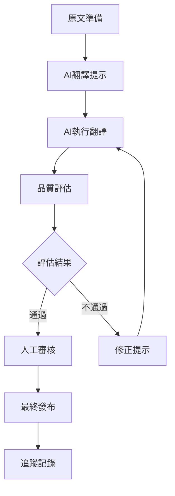

# 🔄 AI翻譯工作流程

道教經典翻譯系統 v2.0 - AI翻譯完整工作流程指南

## 🎯 工作流程概覽



## 📋 詳細步驟

### 步驟1: 原文準備 📖

#### 1.1 檢查原文品質
```bash
# 確認原文檔案存在且格式正確
ls docs/source_texts/書名_ID/原文/
```

#### 1.2 原文預處理
- 檢查文字是否完整
- 確認段落劃分合理
- 標記疑難字詞
- 準備文化背景資料

#### 1.3 建立翻譯檔案
```bash
# 從原文建立翻譯模板
cp docs/source_texts/書名_ID/原文/01_章節.txt temp_translation.md
```

### 步驟2: 準備AI翻譯提示 🤖

#### 2.1 載入標準提示詞
```bash
# 使用標準提示詞模板
cat config/templates/ai_translation_prompt.md
```

#### 2.2 客製化提示詞
根據具體經典特點調整：

**太上系列經典**:
```
特別注意：
- 保持神聖莊重的語氣
- 「太上」指太上老君，保持原詞
- 注意尊稱的正確使用
```

**抱朴子系列**:
```
特別注意：
- 這是葛洪的理論著作
- 涉及大量煉丹術語，需準確翻譯
- 哲學概念要準確傳達
```

**度人經系列**:
```
特別注意：
- 體現慈悲救度的精神
- 「度人」、「救苦」等概念要準確
- 注意功德、慈悲等佛道共通概念
```

#### 2.3 組合完整提示
```markdown
[系統角色設定]
[翻譯任務說明]
[特定經典指導]
[原文內容]
```

### 步驟3: AI執行翻譯 🎨

#### 3.1 選擇AI模型
推薦模型優先級：
1. **GPT-4** - 最佳品質，適合重要經典
2. **Claude-3** - 良好的中文理解，適合一般翻譯
3. **文心一言** - 中文特化，適合術語豐富的文本
4. **通義千問** - 成本效益佳，適合批量處理

#### 3.2 執行翻譯
```python
# 使用API調用AI翻譯
import openai

def translate_with_ai(prompt, original_text):
    response = openai.ChatCompletion.create(
        model="gpt-4",
        messages=[
            {"role": "system", "content": prompt},
            {"role": "user", "content": original_text}
        ],
        temperature=0.3,  # 較低溫度確保一致性
        max_tokens=2000
    )
    return response.choices[0].message.content
```

#### 3.3 儲存初始翻譯
```bash
# 儲存AI翻譯結果
echo "$ai_translation" > docs/translations/書名_ID/01_章節_draft.md
```

### 步驟4: 品質評估 📊

#### 4.1 自動評估
```bash
# 使用評估工具
python tools/ai_translation_evaluator.py docs/translations/書名_ID/01_章節_draft.md
```

#### 4.2 評估標準
- **格式規範** (30%): 是否符合標準格式
- **內容品質** (40%): 翻譯準確性和流暢性
- **術語使用** (30%): 專業術語是否正確

#### 4.3 評估結果處理
```bash
# 檢查評估報告
cat docs/translations/書名_ID/01_章節_draft.evaluation.md

# 根據評分決定下一步
if [ score >= 80 ]; then
    echo "進入人工審核階段"
else
    echo "需要重新翻譯"
fi
```

### 步驟5: 迭代改進 🔄

#### 5.1 問題分析
根據評估報告分析問題：
- **格式問題**: 調整輸出格式要求
- **術語問題**: 強化術語指導
- **內容問題**: 改進翻譯策略

#### 5.2 提示詞優化
```markdown
# 針對發現的問題調整提示詞
特別注意以下問題：
- [具體問題1]: [解決方案]
- [具體問題2]: [解決方案]
```

#### 5.3 重新翻譯
使用優化後的提示詞重新執行翻譯

### 步驟6: 人工審核 👥

#### 6.1 專業審核
- **道教專家**: 檢查宗教文化準確性
- **古文專家**: 檢查原文理解準確性
- **現代中文專家**: 檢查語言表達品質

#### 6.2 審核清單
```markdown
□ 原文理解是否準確
□ 專業術語是否正確
□ 文化背景是否適當
□ 現代中文是否流暢
□ 格式是否規範
□ 註解是否充分
```

#### 6.3 修改建議
```markdown
# 審核意見模板
## 需要修改的地方
1. [位置]: [問題] → [建議修改]
2. [位置]: [問題] → [建議修改]

## 整體建議
- [整體建議1]
- [整體建議2]
```

### 步驟7: 最終發布 📢

#### 7.1 整合修改
```bash
# 應用審核建議
vim docs/translations/書名_ID/01_章節.md
```

#### 7.2 最終檢查
```bash
# 最終品質檢查
python tools/ai_translation_evaluator.py docs/translations/書名_ID/01_章節.md
```

#### 7.3 發布到系統
```bash
# 更新追蹤系統
python main.py monitor reports

# 更新網頁資料
python update_web_data.py
```

### 步驟8: 追蹤記錄 📝

#### 8.1 記錄翻譯資訊
```json
{
  "translation_record": {
    "chapter": "01_章節名稱",
    "ai_model": "gpt-4",
    "translation_date": "2025-01-01",
    "evaluator_score": 85,
    "human_reviewer": "專家姓名",
    "revision_count": 2,
    "final_score": 92
  }
}
```

#### 8.2 更新統計
```bash
# 更新翻譯進度
python main.py monitor dashboard
```

## 🛠️ 工具和腳本

### 批量翻譯腳本
```bash
#!/bin/bash
# batch_translate.sh

for file in docs/source_texts/*/原文/*.txt; do
    echo "翻譯: $file"
    python tools/ai_translator.py "$file"
    python tools/ai_translation_evaluator.py "${file%.txt}.md"
done
```

### 品質監控腳本
```bash
#!/bin/bash
# quality_monitor.sh

# 檢查所有翻譯檔案的品質
find docs/translations -name "*.md" | while read file; do
    if [ ! -f "${file%.md}.evaluation.md" ]; then
        python tools/ai_translation_evaluator.py "$file"
    fi
done
```

### 進度統計腳本
```python
# progress_stats.py
def calculate_translation_progress():
    total_chapters = count_source_files()
    translated_chapters = count_translation_files()
    ai_translated = count_ai_translations()
    human_reviewed = count_reviewed_translations()
    
    return {
        "total": total_chapters,
        "ai_translated": ai_translated,
        "human_reviewed": human_reviewed,
        "completion_rate": human_reviewed / total_chapters * 100
    }
```

## 📊 品質控制指標

### KPI指標
- **翻譯完成率**: 已翻譯章節 / 總章節數
- **品質通過率**: 評分≥80的翻譯 / 總翻譯數
- **人工審核率**: 人工審核章節 / AI翻譯章節
- **返工率**: 需要重新翻譯的章節 / 總翻譯數

### 品質標準
- **優秀**: 評分≥90，可直接發布
- **良好**: 評分80-89，需簡單審核
- **及格**: 評分70-79，需詳細審核
- **不及格**: 評分<70，需重新翻譯

## 🔧 故障排除

### 常見問題
1. **AI翻譯品質不穩定**
   - 檢查提示詞是否完整
   - 調整模型溫度參數
   - 增加範例和約束

2. **術語使用不一致**
   - 更新術語對照表
   - 強化術語檢查規則
   - 增加術語訓練資料

3. **格式不符合規範**
   - 檢查輸出格式要求
   - 增加格式檢查規則
   - 提供更多格式範例

### 效能優化
- 使用批量API調用降低成本
- 快取常用術語翻譯
- 並行處理多個章節
- 預處理常見格式問題

---

*AI翻譯工作流程 - 道教經典翻譯系統 v2.0* 🔄✨