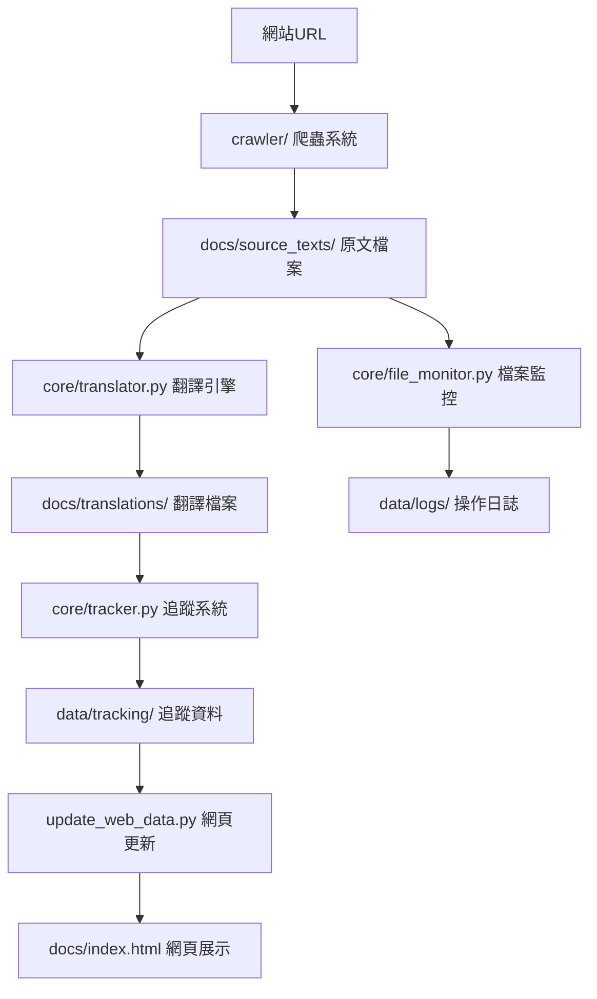

# 📊 資料流程說明

道教經典翻譯系統 v2.0 的完整資料處理流程

## 🔄 整體資料流程



## 📁 目錄結構與資料關係

### 輸入資料
```
crawler/                    # 爬蟲工具集
├── shidian_simple.py      # 主要爬蟲工具
├── base_crawler.py        # 基礎爬蟲引擎
└── ...                    # 其他專業爬蟲
```

### 處理核心
```
core/                      # 核心處理模組
├── translator.py          # 翻譯引擎（調用爬蟲）
├── tracker.py             # 追蹤系統（記錄資料）
└── file_monitor.py        # 檔案監控（記錄操作）
```

### 輸出資料
```
docs/                      # 最終輸出
├── source_texts/          # 爬取的原文
│   └── 書名_ID/
│       ├── README.md      # 書籍說明
│       └── 原文/
│           └── *.txt      # 章節原文
├── translations/          # 生成的翻譯
│   └── 書名_ID/
│       └── *.md          # 章節翻譯模板
└── index.html            # 網頁展示介面
```

### 追蹤資料
```
data/                      # 系統資料
├── tracking/              # 追蹤資料
│   ├── classics.json     # 經典資料庫
│   └── tracking_report.md # 追蹤報告
└── logs/                 # 操作日誌
    ├── file_operations.json # 檔案操作記錄
    └── activity_report.md   # 活動報告
```

## 🔧 關鍵處理腳本

### 1. 主要翻譯流程
```bash
# 使用者執行
python main.py translate --book "書籍URL"

# 內部流程
main.py → tools/easy_cli.py → core/translator.py → crawler/shidian_simple.py
```

### 2. 資料追蹤流程
```python
# core/translator.py 中的自動追蹤
def save_source_text(self, content_data, chapter_number):
    # 1. 儲存檔案
    with open(file_path, 'w', encoding='utf-8') as f:
        f.write(content)
    
    # 2. 記錄檔案操作
    self.file_monitor.track_file_write(file_path, "source_text")
    
    # 3. 更新追蹤系統
    self.tracker.track_new_classic(book_info, chapters, ...)
```

### 3. 網頁資料更新流程
```bash
# 自動更新網頁資料
python update_web_data.py

# 內部流程：
# 1. 掃描 docs/source_texts/ 目錄
# 2. 提取書籍和章節資訊
# 3. 更新 docs/js/script.js 中的資料結構
# 4. 生成 docs/web_data_report.md 報告
```

## 📋 詳細處理步驟

### 步驟1: 爬取原文
```
輸入: 書籍URL (如 https://www.shidianguji.com/book/DZ0001)
處理: crawler/shidian_simple.py
輸出: docs/source_texts/書名_ID/原文/*.txt
記錄: data/logs/file_operations.json
```

### 步驟2: 生成翻譯模板
```
輸入: docs/source_texts/書名_ID/原文/*.txt
處理: core/translator.py
輸出: docs/translations/書名_ID/*.md
記錄: data/tracking/classics.json
```

### 步驟3: 更新追蹤系統
```
輸入: 新增的檔案和資料
處理: core/tracker.py
輸出: data/tracking/tracking_report.md
記錄: 統計資訊和進度
```

### 步驟4: 更新網頁資料
```
輸入: docs/source_texts/ 和 docs/translations/
處理: update_web_data.py
輸出: 更新 docs/js/script.js
記錄: docs/web_data_report.md
```

## 🔍 資料驗證流程

### 自動驗證
```python
# 在 core/translator.py 中
def validate_data(self):
    # 1. 檢查原文檔案完整性
    # 2. 驗證翻譯模板格式
    # 3. 確認追蹤資料一致性
    # 4. 檢查網頁資料同步
```

### 手動驗證
```bash
# 檢查系統狀態
python main.py info

# 檢查追蹤報告
python main.py monitor dashboard

# 檢查網頁資料
python update_web_data.py
```

## 🔄 資料同步機制

### 自動同步
- **檔案寫入時**: 自動記錄到 file_monitor
- **新增經典時**: 自動更新 tracker
- **系統啟動時**: 自動檢查資料一致性

### 手動同步
```bash
# 重新掃描所有資料
python tools/migrate_data.py

# 更新網頁資料
python update_web_data.py

# 生成最新報告
python main.py monitor reports
```

## 📊 資料格式規範

### 原文檔案格式
```
檔名: 01_章節標題.txt
內容: 純文字，UTF-8 編碼
結構: # 標題 + 內容
```

### 翻譯檔案格式
```
檔名: 01_章節標題.md
內容: Markdown 格式
結構: 
# 標題
## 原文
[原文內容]
## 翻譯
[翻譯內容]
## 註解
[註解內容]
```

### 追蹤資料格式
```json
{
  "metadata": {
    "created": "ISO時間戳",
    "version": "2.0",
    "total_classics": 數字
  },
  "classics": {
    "書籍ID": {
      "book_info": {...},
      "chapters": [...],
      "translation_status": {...}
    }
  }
}
```

## 🛠️ 開發者指南

### 新增資料處理功能
1. 在 `core/` 中建立新的處理模組
2. 在 `tools/` 中建立對應的CLI工具
3. 更新 `main.py` 中的命令路由
4. 更新相關文檔

### 修改資料結構
1. 更新對應的核心模組
2. 執行資料遷移腳本
3. 更新網頁資料結構
4. 測試所有相關功能

### 除錯資料流程
1. 檢查 `data/logs/` 中的操作日誌
2. 查看 `data/tracking/` 中的追蹤資料
3. 使用 `python main.py monitor dashboard` 檢查狀態
4. 檢查瀏覽器控制台的網頁錯誤

---

*資料流程說明 - 道教經典翻譯系統 v2.0* 📊✨