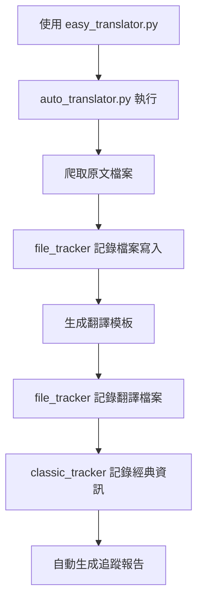

# 📊 經典追蹤系統完整說明

## 🎯 系統概述

經典追蹤系統是一個全自動的檔案和經典管理系統，能夠：
- 🔍 **自動記錄** - 每次新增經典時自動記錄詳細資訊
- 📊 **實時追蹤** - 監控檔案寫入和翻譯進度
- 📈 **統計分析** - 生成詳細的統計報告和分類資訊
- ⏰ **時間戳記** - 記錄每個操作的精確時間

## 🏗️ 系統架構

### 核心組件

| 檔案 | 功能 | 說明 |
|------|------|------|
| `classic_tracker.py` | 經典追蹤核心 | 管理經典資料庫和統計 |
| `file_tracker.py` | 檔案操作追蹤 | 記錄所有檔案寫入操作 |
| `tracking_monitor.py` | 監控儀表板 | 提供實時狀態和報告 |
| `update_tracker.py` | 手動更新工具 | 掃描現有經典並添加 |

### 資料檔案

| 檔案 | 內容 | 用途 |
|------|------|------|
| `經典追蹤記錄.json` | 經典詳細資料庫 | 儲存所有經典的完整資訊 |
| `經典追蹤報告.md` | 統計報告 | 人類可讀的統計摘要 |
| `檔案追蹤日誌.json` | 檔案操作歷史 | 記錄所有檔案操作 |
| `追蹤狀態.json` | 即時狀態 | 匯出的當前狀態快照 |

## 🔄 自動化流程

### 1. 新增經典時的自動追蹤



### 2. 檔案寫入時的追蹤流程

```python
# 每次寫入檔案時自動執行
def save_file(file_path, content):
    # 1. 寫入檔案
    with open(file_path, 'w') as f:
        f.write(content)
    
    # 2. 自動追蹤
    track_file_write(file_path, "source_text")
    log_operation("create", file_path, details)
    
    # 3. 自動分析和更新
    if is_classic_file(file_path):
        update_tracking_system()
```

## 📊 追蹤的詳細資訊

### 經典層級追蹤
- **基本資訊**: 書名、作者、ID、URL
- **時間資訊**: 添加時間、最後修改時間
- **內容統計**: 章節數、總字數、檔案大小
- **分類資訊**: 自動生成的分類和標籤
- **檔案雜湊**: 用於檢測內容變更

### 章節層級追蹤
- **章節資訊**: 編號、標題、字數
- **檔案資訊**: 檔案大小、雜湊值
- **時間戳記**: 創建時間、修改時間

### 翻譯進度追蹤
- **完成狀態**: 已完成章節數、總章節數
- **完成百分比**: 自動計算的進度百分比
- **品質檢測**: 區分模板和實際翻譯

## 🎛️ 使用方法

### 基本查看命令

```bash
# 查看基本狀態
python tracking_monitor.py status

# 查看完整儀表板
python tracking_monitor.py dashboard

# 查看翻譯進度
python tracking_monitor.py progress

# 查看最近活動
python tracking_monitor.py activity 10
```

### 實時監控

```bash
# 啟動實時監控（每30秒更新）
python tracking_monitor.py watch

# 自訂更新間隔
python tracking_monitor.py watch 10
```

### 手動管理

```bash
# 掃描現有經典並添加到追蹤系統
python update_tracker.py

# 只生成追蹤報告
python classic_tracker.py

# 匯出狀態為JSON
python tracking_monitor.py export
```

## 📈 統計功能

### 自動生成的統計資訊
- **總體統計**: 經典總數、章節總數、總字數
- **分類統計**: 按類型分組的統計
- **進度統計**: 翻譯完成情況
- **時間統計**: 添加時間分佈

### 智能分類系統
系統會根據書名和作者自動生成分類：

| 分類 | 判斷條件 | 範例 |
|------|----------|------|
| 道家經典 | 包含"道德經"、"老子" | 道德經 |
| 道教理論 | 包含"抱朴子" | 抱朴子內篇 |
| 道教經文 | 包含"太上"、"元始" | 太上元始天尊證果真經 |
| 養生修煉 | 包含"保命"、"長生" | 太乙元真保命長生經 |
| 度化經典 | 包含"度人" | 洞玄靈寶無量度人經 |

## 🔍 進階功能

### 檔案變更檢測
- 使用MD5雜湊值檢測檔案變更
- 自動記錄修改時間
- 追蹤檔案大小變化

### 翻譯品質檢測
```python
def is_real_translation(file_path):
    """檢測是否為實際翻譯（非模板）"""
    with open(file_path, 'r') as f:
        content = f.read()
        # 檢查是否包含模板標記
        if '[此處應為現代中文翻譯]' in content:
            return False
        # 檢查內容長度
        if len(content) < 1000:
            return False
        return True
```

### 自動標籤生成
系統會根據書名、作者、內容自動生成相關標籤：
- **朝代標籤**: 唐代、宋代、晉代等
- **作者標籤**: 葛洪、老子等
- **主題標籤**: 煉丹、修仙、哲學等
- **類型標籤**: 經典、理論、實踐等

## 🎯 實際應用場景

### 1. 日常使用
```bash
# 添加新經典（自動追蹤）
python easy_translator.py --book "新書籍URL"

# 查看當前狀態
python tracking_monitor.py dashboard
```

### 2. 進度管理
```bash
# 查看翻譯進度
python tracking_monitor.py progress

# 實時監控翻譯活動
python tracking_monitor.py watch
```

### 3. 資料分析
```bash
# 匯出詳細資料
python tracking_monitor.py export

# 查看活動歷史
python tracking_monitor.py activity 50
```

## ✨ 系統優勢

### 🔄 完全自動化
- 無需手動記錄，系統自動追蹤所有操作
- 自動生成報告和統計資訊
- 自動檢測和分類新內容

### 📊 豐富統計
- 多維度統計分析
- 實時進度追蹤
- 歷史趨勢分析

### 🎯 智能分析
- 自動內容分類
- 智能標籤生成
- 品質自動檢測

### 🔍 詳細記錄
- 完整的操作歷史
- 精確的時間戳記
- 檔案變更追蹤

## 🚀 未來擴展

### 可能的增強功能
- **Web介面**: 提供網頁版儀表板
- **API介面**: 提供REST API存取
- **通知系統**: 重要事件自動通知
- **備份系統**: 自動備份追蹤資料
- **協作功能**: 多人協作翻譯追蹤

---

*本系統於 2025-08-09 完成，提供完整的經典追蹤和管理功能* 📊✨